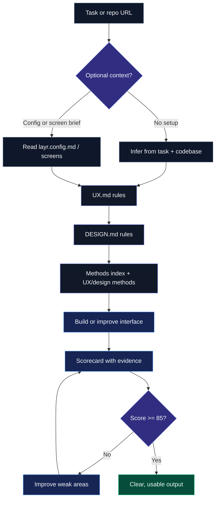

# UX + Design System (for AI-built Websites / apps)

A rule-based UX and design system for AI-built apps, turning proven principles into enforceable constraints that reduces friction, builds trust, and drives action.

## Before vs After

Turn messy AI output into clean, structured UI.

<p align="center">
  
</p>

## Quick Setup Guide

Layr works with zero setup.

Start with Option 1.
If your AI tool cannot read GitHub URLs, use Option 2.

### Option 1 - Paste the repo URL

Use this when your AI tool can read GitHub URLs.

Copy this prompt, paste it into your AI model, then replace the task line with your own request:

```text
Use https://github.com/layr-hq/layr as the UX and design system.

Read RUN.md first, then follow it.

Task:
Improve the pricing page so users can choose a plan faster.
```

### Option 2 - Add Layr to your project

Use this when your AI tool works best with local files or cannot reliably read GitHub URLs.

1. Download or clone this repo into your project root as `layr`.
2. Copy this prompt and paste it into your AI model.
3. Replace the task line with your own request.

```text
Use ./layr/RUN.md for this task:

Improve the pricing page so users can choose a plan faster.
```

### Option 3 - Add optional product context

This is optional.
Use it when you want stronger product and brand fit.

1. Copy this file:

```text
layr/layr.config.example.md
```

2. Rename the copy to:

```text
layr/layr.config.md
```

3. Fill only what you know. Leave the rest blank.

Do not edit `UX.md`, `DESIGN.md`, `methods/`, or `RUN.md`.

### Option 4 - Add optional screen context

This is optional.
Use it for important screens where precision matters.

1. Copy the screen template:

```text
layr/screens/screen-template.md
```

2. Rename the copy to match the screen:

```text
layr/screens/pricing.md
layr/screens/onboarding.md
layr/screens/dashboard.md
```

3. Fill only the fields that materially affect the result.

---

## Example

“Create a dashboard for a project management app”

→ Output follows UX rules automatically

---

## Table of Contents

- [What this is](#what-this-is)
- [What it’s based on / Methods](#what-its-based-on--methods)
- [Why it matters](#why-it-matters)
- [How the system works](#how-the-system-works)
- [Quality modes](#quality-modes)
- [Module roadmap](#module-roadmap)
- [Instructions](#instructions)
- [Files](#files)
- [Version history](#version-history)
- [Goal](#goal)
- [License](#license)

---

## What this is

A rule-based UX + design system for AI.

It turns proven principles into strict rules the AI must follow when building.

---

## What it’s based on / Methods

- Hick’s Law - reduce choices  
- Cognitive Load - reduce thinking  
- Fitts’s Law - make actions easy  
- Jakob’s Law - use familiar patterns  
- Peak-End Rule - strong finish matters  
- Goal Gradient - show progress  
- Gestalt - clear structure  
- Signal vs Noise - remove clutter  
- Default Bias - guide decisions  
- Colour Theory - guide attention
- Typography - improve readability
- Spacing Rhythm - clarify structure
- and more

Most people know these.  
This system enforces them.

---

## Why it matters

AI builds for functionality, not usability.

So you get:

- messy UI  
- too many decisions  
- poor flows  

This system forces:

- clarity  
- speed  
- obvious next steps  

---

Build with real UX standards, not AI guesses.

---

## How the system works



---

## Quality modes

| Mode | Best for | What the user provides | Quality |
| --- | --- | --- | --- |
| Zero setup | Trying Layr quickly, simple fixes, reviews | Task only | Strong generic UX improvement |
| Recommended | Real product work | Task + optional `layr.config.md` | Better product, user, and brand fit |
| Screen-level | High-value screens and flows | Task + config + optional screen brief | Highest precision |

Layr should never block on missing context unless the missing detail would materially change the UX direction.

If context is missing, the AI should infer it and state assumptions briefly.

---

## Module roadmap

Layr currently ships with active UX and Design modules.

The system is structured to expand into Accessibility, Conversion Rate Optimisation, SEO, Marketing, Copywriting, and other production modules over time.

Those future modules are listed in `ROADMAP.md`, but they are not treated as active Layr systems until their rule files and methods exist.

The user experience stays the same:

```text
Use Layr for this task:
```

Layr should choose the relevant active modules automatically.

---

## Instructions

Use this system to design screens that are fast, obvious, and require zero thinking.

### Step 1 - Load Layr

If your AI tool can read GitHub URLs, copy this prompt and paste it into your AI model:

```text
Use https://github.com/layr-hq/layr as the UX and design system.
Read RUN.md first, then follow it.

Task:
Improve the pricing page so users can choose a plan faster.
```

If your AI tool cannot read GitHub URLs, download or clone this repo into your project root as `layr`.

Then copy this prompt and paste it into your AI model:

```text
Use ./layr/RUN.md for this task:

Improve the pricing page so users can choose a plan faster.
```

If your AI tool cannot read GitHub URLs reliably, use the local folder option.

### Step 2 - Describe the task

Replace the example task with what you want the AI to build, fix, review, or improve.

Good:

```text
Improve the pricing page so users can choose a plan faster.
```

Better:

```text
Improve the pricing page for early-stage SaaS founders.
The primary action is starting a free trial.
Preserve the existing design system.
```

### Step 3 - Add context only when useful

This step is optional.

For better product fit, copy `layr.config.example.md`, rename the copy to `layr.config.md`, and fill only what you know.

Minimum useful context:

```text
Product name:
Primary user:
Core user goal:
Primary product action:
Design source:
```

This is optional. Layr still works without it.

### Step 4 - Add screen briefs only for important screens

This step is optional.

For important screens, copy `layr/screens/screen-template.md`, rename the copy, and fill only what matters.

Minimum useful screen context:

```text
Screen name:
User intent:
Primary goal:
Primary action:
```

This is optional. Layr should infer missing screen context from the task and codebase.

### Step 5 - Let the AI build and refine

The AI will:

- read Layr rules
- select relevant methods
- infer missing context when safe
- ask at most 3 questions only when context is truly blocking
- build or improve the UI
- score the result with evidence
- fix weak areas
- repeat until the screen scores at least 85

---

## Files

| File | Purpose | User edits? |
| --- | --- | --- |
| `RUN.md` | Main entry point for AI tools | No |
| `modules/index.md` | Active and planned module routing | No |
| `UX.md` | UX behaviour, rules, scoring, and validation | No |
| `DESIGN.md` | Layout, hierarchy, spacing, and visual clarity | No |
| `methods/index.md` | Helps the AI choose relevant methods | No |
| `methods/ux/*.md` | Behaviour, cognition, interaction, flow, and trust methods | No |
| `methods/design/*.md` | Colour, type, layout, spacing, component, and motion methods | No |
| `scorecard.md` | Evidence-based UX scoring | No |
| `layr.config.example.md` | Optional product context template | Copy to `layr.config.md` |
| `screens/screen-template.md` | Optional screen brief template | Copy for important screens |
| `prompts/master.md` | Compatibility prompt for users who prefer `/prompts` | No |
| `ROADMAP.md` | Future module direction | No |
| `CHANGELOG.md` | Version history and release notes | No |

---

## Version history

See `CHANGELOG.md` for version history.

Use GitHub Releases when publishing a tagged release.
Use `CHANGELOG.md` for the in-repo history that readers can see directly from the repository.

---

## Goal

The user should:

- understand instantly  
- know exactly what to do  
- take action without hesitation  
- never feel confused or overwhelmed  
- move through the flow with minimal effort  
- reach value as quickly as possible  

The experience should feel:

- obvious  
- fast  
- clear  
- predictable  
- low effort  

If the user has to:

- think  
- re-read  
- hesitate  
- search for what to do  

It failed.

---

## License

Free to use in personal and commercial projects.

Not allowed to resell or redistribute this as a standalone product.

---

Build with real UX standards, not AI guesses.
