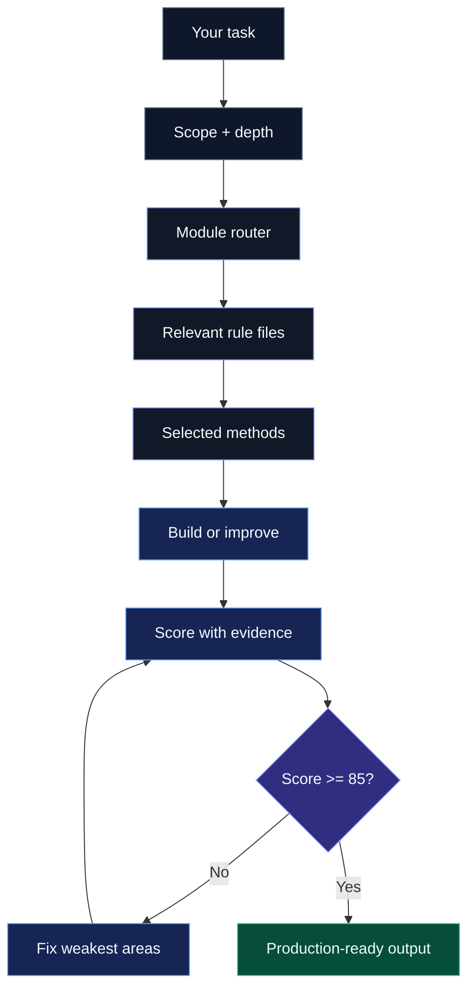

# Layr - Production System for AI-Built Apps

A modular UX, design, and product optimisation system for turning AI-built interfaces into production-grade apps. Layr turns proven principles into enforceable constraints that reduce friction, build trust, and drive action.

Use Layr when AI can build the feature, but you need the result to feel like a real product: clear, fast, accessible, measurable, trustworthy, and ready to ship.

Create your system at [layrhq.io](https://layrhq.io).

## What Layr Does

AI tools are good at producing screens. They are less reliable at producing product-quality experiences.

Layr gives your AI model a production layer:

- what to prioritise
- which principles to apply
- which risks to catch
- which methods to use
- how to score the result
- when to keep improving

It works with Claude, Codex, Cursor, ChatGPT, and any AI tool that can read a GitHub repo or local project files.

No package install. No build step. No required setup.

Copy the prompt, give the model your task, and Layr tells it how to think.

## Before vs After

Turn messy AI output into clean, structured UI.

<p align="center">
  
</p>

## Quick Start

### Option 1 - Paste The Repo URL

Use this when your AI tool can read GitHub URLs.

Copy this prompt and paste it into your AI model:

```text
Use https://github.com/layr-hq/layr as the production system for AI-built apps.
Read RUN.md first, then follow it.

Scope: Auto
Depth: Standard

Task:
Improve the pricing page so users can choose a plan faster.
```

Replace the task with what you want built, reviewed, or improved.

If Layr saves you from manually rebuilding AI-generated UI, star the repo so more builders can find it.

### Option 2 - Add Layr To Your Project

Use this when your AI tool works best with local files.

1. Download or clone this repo into your project root as `layr`.
2. Copy this prompt and paste it into your AI model.
3. Replace the task with your own request.

```text
Use ./layr/RUN.md for this task.

Scope: Auto
Depth: Standard

Task:
Improve the onboarding flow so new users reach value faster.
```

## Why This Exists

AI-built apps often look finished before they are product-ready.

Common problems:

- unclear primary actions
- weak hierarchy
- too many decisions
- poor onboarding
- inaccessible interactions
- vague copy
- missing trust signals
- fragile AI outputs
- slow or unstable screens
- no useful analytics
- untested edge cases
- conversion leaks
- weak SEO or AI-search visibility

Layr forces the model to treat those as product requirements, not optional polish.

## The Real Power

Layr is not a prompt pack, skill, or agent.

It is a modular rule system with 160+ enforceable methods across UX, design, accessibility, security, performance, analytics, QA, AI-product experience, conversion, SEO, marketing, and copywriting.

The model does not run everything blindly.

It reads the task, selects the right modules, applies the right methods, scores the result, fixes weak areas, and repeats until the output reaches production quality.

That means you can ask for something simple:

```text
Use Layr to improve this dashboard.
```

Or you can control the exact focus:

```text
Scope: UX, CRO, Copywriting
Depth: Standard

Improve the pricing page for early-stage SaaS founders.
The primary action is starting a free trial.
Preserve the existing design system.
```

## Active Modules

Layr is modular. Use `Scope: Auto` for normal work, or name the modules you want.

| Module | Use It For | Example Methods |
| --- | --- | --- |
| UX | task flow, cognition, interaction, friction, trust, time to value | Fitts's Law, Hick's Law, Cognitive Load, Mental Models, Recognition Over Recall |
| Design | hierarchy, layout, typography, spacing, colour, components, states | Visual Hierarchy, Grid Systems, Typography, Design Tokens, Data Visualisation |
| Accessibility | keyboard, focus, semantics, contrast, names, motion, reflow | WCAG POUR, Focus Management, Accessible Names, Target Size, Reduced Motion |
| Security | permissions, auth, validation, sensitive actions, data risk | Least Privilege, Secure Defaults, CSRF Protection, XSS Prevention, Audit Logging |
| Performance | speed, loading, responsiveness, stability, asset weight | Performance Budget, Loading Strategy, Interaction Responsiveness, Asset Optimization |
| Analytics | events, funnels, activation, experiments, privacy-aware tracking | Event Taxonomy, Funnel Instrumentation, Activation Metrics, Experiment Measurement |
| QA | release readiness, regression risk, browsers, responsive checks | Responsive QA, Cross Browser QA, Edge Case States, Regression Checklist |
| AI Product | AI generation, agents, model outputs, human control, evaluation | Prompt Input Design, Output Trust, Human Control, AI Fallbacks, AI Evaluation |
| CRO | conversion, signup, checkout, pricing, trials, lead capture | Value Proposition Clarity, Message Match, Objection Handling, Price Anchoring |
| SEO | public pages, metadata, crawlability, structured data, authority | Search Intent, Semantic HTML, Structured Data, Topical Authority, Core Web Vitals |
| AI Search | AI answers, ChatGPT Search, Copilot, GEO, answer engines | AI Search Visibility, E-E-A-T Signals, Structured Data, Content Refresh |
| Marketing | positioning, offers, differentiation, launches, audience fit | Positioning, Category Design, Proof Stack, Channel Message Fit, Launch Sequencing |
| Copywriting | headlines, CTAs, errors, onboarding, pricing, trust copy | Clarity First, Headline Clarity, Plain Language, Objection Copy, Trust Copy |

There is much more in the method library. Start with [methods/index.md](./methods/index.md) to see how Layr chooses the right methods for each task.

## How It Works



Layr uses:

- [RUN.md](./RUN.md) as the main entry point
- [modules/index.md](./modules/index.md) to choose active modules
- [methods/index.md](./methods/index.md) to select methods
- module rule files like [UX.md](./UX.md), [DESIGN.md](./DESIGN.md), [SECURITY.md](./SECURITY.md), and [AI.md](./AI.md)
- [scorecard.md](./scorecard.md) to enforce evidence-based quality

## Scope And Depth

By default:

```text
Scope: Auto
Depth: Standard
```

Use `Scope:` to control what Layr focuses on.

Examples:

```text
Scope: UX, Design, Accessibility
```

```text
Scope: CRO, Marketing, Copywriting
```

```text
Scope: SEO, AI Search
```

```text
Scope: AI Product, Security, QA
```

Supported scopes:

- `Auto`
- `UX`
- `Design`
- `Accessibility`
- `Security`
- `Performance`
- `Analytics`
- `QA`
- `AI Product`
- `CRO`
- `SEO`
- `AI Search`
- `Marketing`
- `Copywriting`

Use `Depth:` to control how much analysis Layr applies.

| Depth | Use For | Method Count |
| --- | --- | --- |
| `Quick` | small fixes, quick reviews, obvious issues | 2-4 methods |
| `Standard` | normal product work | 4-8 methods |
| `Deep` | launches, audits, security, SEO, AI agents, conversion-critical flows | 8-14 methods |

Layr should not load the whole system unless you ask for a full audit.

## Example Prompts

### Improve A Pricing Page

```text
Use https://github.com/layr-hq/layr as the production system for AI-built apps.
Read RUN.md first, then follow it.

Scope: UX, CRO, Copywriting
Depth: Standard

Task:
Improve the pricing page so users can choose a plan faster.
The primary action is starting a free trial.
Preserve the existing design system.
```

### Review A Public Page For SEO And AI Search

```text
Use ./layr/RUN.md for this task.

Scope: SEO, AI Search, Copywriting
Depth: Deep

Task:
Improve this public product page so it is easier to understand, index, and cite in AI answers.
The target search intent is comparing AI design review tools.
```

### Improve An AI Feature

```text
Use ./layr/RUN.md for this task.

Scope: AI Product, UX, Security, QA
Depth: Deep

Task:
Improve the AI assistant flow so users can generate, verify, edit, and approve suggested customer replies before sending.
```

### Run A Production Readiness Pass

```text
Use ./layr/RUN.md for this task.

Scope: QA, Performance, Accessibility, Security, Analytics
Depth: Deep

Task:
Review the checkout flow before launch. Find anything that could hurt completion, trust, measurement, accessibility, or release safety.
```

## Optional Context

Layr works without setup.

For stronger product fit, add context only when it helps.

You can paste context directly into your prompt:

```text
Optional context:
Product name:
Audience:
Primary action:
Conversion goal:
Target search query:
AI search goal:
Security-sensitive data:
Performance target:
Analytics goal:
AI feature goal:
Brand voice:
Known objections:
Things to avoid:
```

Or copy [layr.config.example.md](./layr.config.example.md) to `layr.config.md` and fill only what you know.

For high-value screens, copy [screens/screen-template.md](./screens/screen-template.md) and fill only the details that materially affect the result.

Do not edit Layr module files, `methods/`, or `RUN.md`.

## When To Use Layr

Use Layr for:

- landing pages
- pricing pages
- dashboards
- onboarding
- signup and checkout
- AI assistants and agents
- public SEO pages
- design system cleanups
- accessibility passes
- conversion improvements
- launch readiness reviews
- security-sensitive flows

Layr is especially useful when the UI already exists but feels unclear, generic, untrusted, slow, inaccessible, or not ready to ship.

## What Layr Is Not

Layr is not:

- a component library
- a CSS framework
- a design template
- an analytics SDK
- a replacement for product judgment

It is the rule system you plug into your AI model so the model builds with better product judgment.

## Files

| File | Purpose | User edits? |
| --- | --- | --- |
| [RUN.md](./RUN.md) | Main entry point for AI tools | No |
| [modules/index.md](./modules/index.md) | Active module routing | No |
| [methods/index.md](./methods/index.md) | Method selection router | No |
| [scorecard.md](./scorecard.md) | Evidence-based quality scoring | No |
| [UX.md](./UX.md) | UX behaviour, flow, and validation rules | No |
| [DESIGN.md](./DESIGN.md) | Visual design and interface craft rules | No |
| [ACCESSIBILITY.md](./ACCESSIBILITY.md) | Accessibility rules and validation | No |
| [SECURITY.md](./SECURITY.md) | Security rules and safe defaults | No |
| [PERFORMANCE.md](./PERFORMANCE.md) | Performance rules and validation | No |
| [ANALYTICS.md](./ANALYTICS.md) | Analytics and measurement rules | No |
| [QA.md](./QA.md) | QA and release readiness rules | No |
| [AI.md](./AI.md) | AI-product experience rules | No |
| [CRO.md](./CRO.md) | Conversion rate optimisation rules | No |
| [SEO.md](./SEO.md) | Search, discoverability, and AI-search rules | No |
| [MARKETING.md](./MARKETING.md) | Positioning and product messaging rules | No |
| [COPYWRITING.md](./COPYWRITING.md) | Product copy and microcopy rules | No |
| [layr.config.example.md](./layr.config.example.md) | Optional product context template | Copy if useful |
| [screens/screen-template.md](./screens/screen-template.md) | Optional screen brief template | Copy if useful |
| [prompts/master.md](./prompts/master.md) | Compatibility prompt for users who prefer `/prompts` | No |
| [ROADMAP.md](./ROADMAP.md) | Module direction | No |
| [CHANGELOG.md](./CHANGELOG.md) | Version history | No |

## Method Library

The method library lives in:

- [methods/ux](./methods/ux)
- [methods/design](./methods/design)
- [methods/accessibility](./methods/accessibility)
- [methods/security](./methods/security)
- [methods/performance](./methods/performance)
- [methods/analytics](./methods/analytics)
- [methods/qa](./methods/qa)
- [methods/ai](./methods/ai)
- [methods/cro](./methods/cro)
- [methods/seo](./methods/seo)
- [methods/marketing](./methods/marketing)
- [methods/copywriting](./methods/copywriting)

Each method follows the same structure:

- what it is
- why it matters
- when to apply it
- how to apply it
- implementation rules
- examples
- fail conditions
- enforcement rule

## Goal

The product should be:

- obvious
- fast
- useful
- accessible
- trustworthy
- measurable
- resilient
- conversion-ready
- production-ready

If the user has to think too hard, reread, hesitate, recover from preventable errors, or guess what to do next, the interface is not done.

## Version History

See [CHANGELOG.md](./CHANGELOG.md) for version history.

Use GitHub Releases when publishing a tagged release.

## License

Free to use in personal and commercial projects.

Not allowed to resell or redistribute this as a standalone product.

---

Build with real product standards, not AI guesses.
