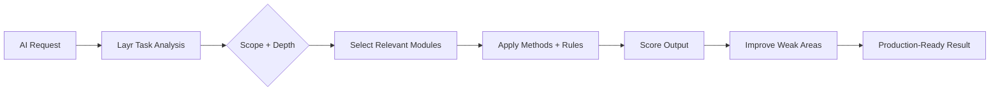

# Layr

> AI can generate apps. Layr turns them into production-grade products.

<p align="center">
  A modular UX, design, and product optimisation system for AI-built software.
</p>

<p align="center">
  Works with Claude, Codex, Cursor, Gemini, Windsurf, Replit and modern agentic AI workflows.
</p>

<p align="center">
  <a href="https://layrhq.io"><strong>Website</strong></a> ·
  <a href="https://layrhq.io"><strong>Documentation</strong></a> ·
  <a href="https://layrhq.io"><strong>Examples</strong></a>
</p>

<p align="center">
  
</p>

---

## What is Layr?

Layr is a rule-based production system that AI models can read and apply to improve software quality automatically.

It is not:
- a prompt pack
- an AI agent
- a skill
- a workflow template
- a UI generator
- a collection of random rules

Layr turns proven principles into enforceable constraints that reduce friction, build trust, and drive action.

---

## Use It Now

Copy this prompt and paste it into your AI model:

```text
Use the Layr production system: https://github.com/layr-hq/layr

Build: [YOUR PRODUCT]

Scope: Auto
Depth: Standard
```

That’s it.

---

## How Layr Works



---

## Scope + Depth

### Scope

```text
Auto
UX
Design
Accessibility
Security
Performance
Analytics
QA
AI Product
CRO
SEO
AI Search
Marketing
Copywriting
```

### Depth

```text
Quick
Standard
Deep
```

### Default

```text
Scope: Auto
Depth: Standard
```

---

## Areas Layr Covers

| System | Focus |
|---|---|
| UX | Cognitive load, hierarchy, flows, decision clarity |
| Design | Visual systems, spacing, consistency, readability |
| Accessibility | WCAG, contrast, keyboard access, screen-reader support |
| Security | Unsafe patterns, exposure risks, auth concerns |
| Performance | Rendering, bundle weight, interaction latency |
| Analytics | Event systems, measurement, behavioural tracking |
| QA | Edge cases, reliability, validation, production checks |
| AI Product | Human control, fallbacks, prompt input design, output trust |
| CRO | Conversion flows, friction reduction, CTA clarity |
| SEO | Technical SEO, semantic structure, indexing |
| AI Search | AI readability, retrieval structure, discoverability |
| Marketing | Positioning, messaging, value communication |
| Copywriting | Clarity, persuasion, behavioural language |

---

## Science-Backed Methods

Layr uses real behavioural, UX, design, performance, and conversion methodologies.

Examples include:

| Area | Methods |
|---|---|
| UX | Hick’s Law, Fitts’s Law, Cognitive Load Theory, Progressive Disclosure |
| Design | Visual Hierarchy, Gestalt Principles, Signal-to-Noise, Grid Systems |
| CRO | Goal Gradient, Price Anchoring, Risk Reversal, Form Conversion |
| Accessibility | WCAG POUR, focus management, semantic structure, target size |
| Performance | Performance budgets, loading strategy, rendering stability, interaction responsiveness |
| SEO | Search intent alignment, structured data, internal linking, indexing |
| AI Search | AI search visibility, entity clarity, retrieval structure |

---

## Example

Copy this prompt and paste it into your AI model:

```text
Use the Layr production system: https://github.com/layr-hq/layr

Build: An AI-powered finance dashboard for freelancers.

Scope: Auto
Depth: Standard
```

---

## Philosophy

AI-generated software should not stop at “working”.

It should be:
- usable
- trusted
- measurable
- accessible
- performant
- conversion-ready
- searchable
- production-grade

AI can generate products.

Layr makes them ready to ship.
