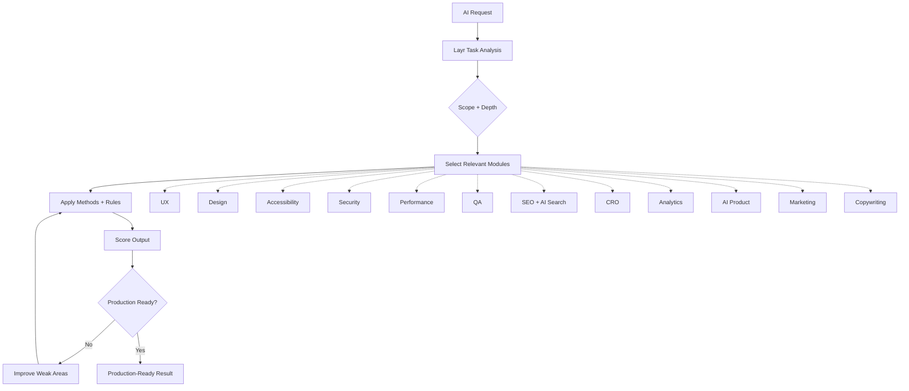

<h1 align="center">Layr</h1>

<p align="center">
  <strong>AI can generate apps. Layr turns them into production-grade products.</strong>
</p>

<p align="center">
  A modular production system for AI-built software.
</p>

<p align="center">
  Works with Claude, Codex, Cursor, Gemini, Windsurf, Replit and modern agentic AI workflows.
</p>

<p align="center">
  <a href="https://layrhq.io"><strong>Website</strong></a>
  ·
  <a href="https://layrhq.io"><strong>Documentation</strong></a>
  ·
  <a href="https://layrhq.io"><strong>Examples</strong></a>
</p>

<br />

<table>
  <tr>
    <td width="33%" align="center">
      <strong>Route</strong><br />
      Selects the right production modules for the task.
    </td>
    <td width="33%" align="center">
      <strong>Enforce</strong><br />
      Turns proven methods into constraints AI can apply.
    </td>
    <td width="33%" align="center">
      <strong>Improve</strong><br />
      Scores weak areas and raises the product quality bar.
    </td>
  </tr>
</table>

<p align="center">
  
</p>

## Use It Now

Copy this prompt and paste it into your AI model:

```text
Use the Layr production system: https://github.com/layr-hq/layr

Build: [YOUR PRODUCT]

Scope: Auto
Depth: Standard
```

That is it. Layr handles the rest.

## What Is Layr?

Layr is a rule-based production system that AI models can read and apply to improve software quality automatically.

Layr is not:

| Not | Also not |
|---|---|
| a prompt pack | an AI agent |
| a workflow template | a UI generator |
| a collection of random rules | a loose checklist |

Layr is a modular intelligence layer that sits between AI generation and production-ready software.

<table>
  <tr>
    <td width="40%" align="center"><strong>AI generation</strong></td>
    <td width="20%" align="center"><strong>Layr</strong></td>
    <td width="40%" align="center"><strong>Production-ready software</strong></td>
  </tr>
  <tr>
    <td align="center">Fast interfaces, components, flows and features</td>
    <td align="center">Rules, methods, scoring and routing</td>
    <td align="center">Usable, trusted, accessible, performant products</td>
  </tr>
</table>

Modern AI tools can generate interfaces, components, flows, and features extremely fast.

But most outputs still fail in the same places:

| Product gap | What usually breaks |
|---|---|
| UX | Weak hierarchy, unclear flows, high cognitive load |
| Design | Inconsistent systems, poor spacing, weak visual discipline |
| Accessibility | Missing semantics, contrast issues, keyboard traps |
| Product thinking | Shallow decisions, missing edge cases, unclear priorities |
| Growth | Weak conversion paths, poor SEO, unclear messaging |
| Production | Fragile security, poor performance, weak QA and measurement |

The result is software that looks impressive at first glance, but breaks under real usage.

Layr fixes that.

## Why Layr Exists

AI models are excellent at generating.

They are not excellent at production standards, behavioural UX, accessibility compliance, performance discipline, CRO, search visibility, product clarity, measurement systems, or long-term maintainability.

Most AI workflows optimise for **generation speed**.

Layr optimises for **production quality**.

## How Layr Works

Layr reads the task, selects the relevant modules, applies the correct methods, scores the output using evidence-based systems, then improves weak areas until the result is production-ready.

Instead of blindly applying every rule, Layr intelligently routes the smallest set of modules that materially improve the task.



## Scope + Depth System

Layr supports controlled invocation so users can run only what they need.

| Control | Options | Default |
|---|---|---|
| Scope | Auto, UX, Design, Accessibility, Security, Performance, Analytics, QA, AI Product, CRO, SEO, AI Search, Marketing, Copywriting | Auto |
| Depth | Quick, Standard, Deep | Standard |

This allows Layr to act as a selective, modular, intelligent production system instead of becoming a bloated universal checklist.

## Areas Layr Covers

| System | Focus |
|---|---|
| UX | Cognitive load, hierarchy, flows, decision clarity |
| Design | Visual systems, spacing, consistency, readability |
| Accessibility | WCAG, contrast, keyboard access, screen-reader support |
| Security | Unsafe patterns, exposure risks, auth concerns |
| Performance | Rendering, bundle weight, interaction latency |
| Analytics | Event systems, measurement, behavioural tracking |
| QA | Edge cases, reliability, validation, production checks |
| AI Product | Human control, fallbacks, prompt input design, output trust |
| CRO | Conversion flows, friction reduction, CTA clarity |
| SEO | Technical SEO, semantic structure, indexing |
| AI Search | AI readability, retrieval structure, discoverability |
| Marketing | Positioning, messaging, value communication |
| Copywriting | Clarity, persuasion, behavioural language |

## Science-Backed Methods

Layr uses real behavioural, UX, design, performance, and conversion methodologies, not random AI opinions.

Examples include:

| Area | Methods |
|---|---|
| UX | Hick's Law, Fitts's Law, Cognitive Load Theory, Progressive Disclosure |
| Design | Visual Hierarchy, Gestalt Principles, Signal-to-Noise, Grid Systems |
| CRO | Goal Gradient, Price Anchoring, Risk Reversal, Form Conversion |
| Accessibility | WCAG POUR, focus management, semantic structure, target size |
| Performance | Performance budgets, loading strategy, rendering stability, interaction responsiveness |
| SEO | Search intent alignment, structured data, internal linking, crawl/indexing control |
| AI Search | AI search visibility, entity clarity, retrieval structure, answer-ready content |

Layr operationalises these methods into enforceable production systems AI can apply automatically.

## Why This Is Different From Agents

| Agents and skills | Layr |
|---|---|
| Generate or solve isolated tasks | Evaluates, routes, scores and improves |
| Optimise for speed and output quantity | Optimises for usability, trust and production quality |
| Depend heavily on the model's default taste | Applies explicit standards and evidence-backed constraints |
| Often miss cross-product concerns | Works across UX, design, accessibility, performance, growth and QA |

Layr works as a production layer on top of any capable AI system.

## Works With

| AI workflow | Support |
|---|---|
| Claude | Yes |
| Codex | Yes |
| Cursor | Yes |
| Gemini | Yes |
| Windsurf | Yes |
| Replit | Yes |
| OpenAI Agents | Yes |
| Modern agentic workflows | Yes |

Layr is model-agnostic.

## Example

Copy this prompt and paste it into your AI model:

```text
Use the Layr production system: https://github.com/layr-hq/layr

Build: An AI-powered finance dashboard for freelancers.

Scope: Auto
Depth: Standard
```

Layr will automatically apply the relevant production systems across UX, design, accessibility, analytics, performance, CRO, copywriting and product behaviour.

## Philosophy

Layr exists because AI-generated software should not stop at **working**.

It should be:

| Standard | Outcome |
|---|---|
| Usable | People understand what to do next |
| Trusted | Interfaces feel clear, safe and credible |
| Measurable | Important behaviour can be tracked and improved |
| Accessible | Real users can navigate and complete tasks |
| Performant | Interactions feel fast and stable |
| Conversion-ready | Actions are clear, low-friction and persuasive |
| Searchable | Content can be understood by search engines and AI systems |
| Production-grade | The product is ready to ship, not just demo |

AI can generate products.

Layr makes them ready to ship.
